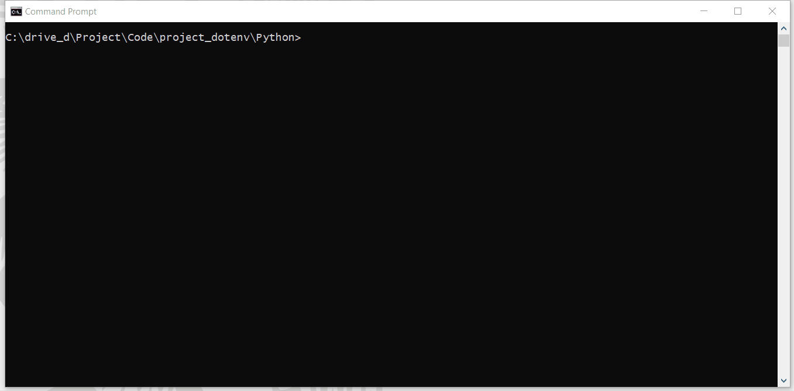

# How to separate your credentials, secrets, and configurations from your source code with environment variables
- version: 2.0
- Last update: January 2025
- Environment: Windows
- Prerequisite: [Access to RDP or RTO credentials](#prerequisite)

## <a id="intro"></a>Introduction

As a modern application, your application always deals with credentials, secrets, and configurations to connect to other services like an Authentication service, Database, Cloud services, Microservices, etc. It is not a good idea to keep your username, password and other credentials in your application source code as your credentials may leak when you share or publish the application. You need to delete or remark those credentials before you share the code which adds extra work for you. And eventually, you may forget to do it. You may pass the credentials to the application via the command line arguments, but someone may see those credentials on your screen as well.

The services configurations such as API endpoint, Database URL, etc should not be hard coded in the source code too. The reason is every time you change or update the configurations you need to modify the code which may lead to more errors. 

How should we solve this issue?

## <a id="12factor_config"></a>Store config in the environment

The [Twelve-Factor App methodology](https://12factor.net/) is one of the most influential patterns to designing scalable software-as-a-service applications. The methodology [3rd factor](https://12factor.net/config) (aka Config principle) states that configuration information should be kept as environment variables and injected into the application on runtime as the following quotes:

>An app’s config is everything that is likely to vary between deploys (staging, production, developer environments, etc). This includes:
>- Resource handles to the database, Memcached, and other backing services
>- Credentials to external services such as Amazon S3 or Twitter
>- Per-deploy values such as the canonical hostname for the deploy
>
>Apps sometimes store config as constants in the code. This is a violation of twelve-factor, which requires strict separation of config from code. Config varies substantially across deploys, code does not.

>The twelve-factor app stores config in environment variables (often shortened to env vars or env). Env vars are easy to change between deploys without changing any code; unlike config files, there is little chance of them being checked into the code repo accidentally; and unlike custom config files, or other config mechanisms such as Java system Properties, they are a language- and OS-agnostic standard.

### <a id="env_variables"></a>What is Environment Variables?

An environment variable is a dynamic-named value that is set through the Operating system, not the program. The variables impact the process the OS and running process. In Windows, you can access the environment variables to view or modify them through This PC --> Properties --> Advanced system settings --> Environment Variables.. menu.

 

The benefits of storing credentials and configurations in environment variables are the following:
1. The credentials and configurations are separated from the code. The project team can change the credentials and configurations based on scenario and environment (Dev, Test, Product, etc) without touching the application source code. 
2. The sensitive information (username, password, token, etc) is kept and maintained locally. The team can share the code among peers without being worried about information leaks. 
3. Reduce the possibility of messing up between environments such as configure the Production server address in the Test environment.  

However, each OS requires a different way to access and modify the variables. It is not always practical to set environment variables on development machines (as the variables may keep growing) or continuous integration servers where multiple projects are run.

These drawbacks lead to the *dotenv* method. 

## <a id="intro_dotenv"></a>Introduction to .env file and dotenv

The dotenv method lets the application loads variables from a ```.env``` file into the environment/running process the same way as the application load variables from the system's environment variables. The application can load or modify the environment variables from the OS and ```.env``` file with a simple function call.

[dotenv](https://github.com/bkeepers/dotenv) is a library that originates from [Ruby](https://www.ruby-lang.org/en/) developers (especially the [Ruby on Rails](https://rubyonrails.org/) framework) and has been widely adopted and ported to many programming languages such as [python-dotenv](https://github.com/theskumar/python-dotenv), [dotenv-java](https://github.com/cdimascio/dotenv-java), [Node.js](https://github.com/motdotla/dotenv), etc. 

The ```.env``` file is a simple text file locates at the root of the project with a key-value pair setting as the following:

``` ini
# DB
DB_USER=User
DB_PASSWORD=MyPassword
# Cloud
CLOUD_URL=192.168.1.1
```

Please note that you *do not* need the ```""``` or ```''``` characters for a string value.

### Caution

You *should not* share this ```.env``` file to your peers or commit/push it to the version control. You should add the file to the ```.gitignore``` file to avoid adding it to version control or public repository accidentally.

You can create a ```.env.example``` file as a template for environment variables and ```.env``` file sharing. The file has the same parameters' keys as a ```.env``` file but without sensitive values as the following example:

``` ini
# DB
DB_USER=
DB_PASSWORD=
# Cloud Public URL, not a sensitive information
CLOUD_URL=192.168.1.1
```

Then you can push this ```.env.example``` file to the repository. Developers who got your source code project can create their own ```.env``` file from this template ```.env.example``` file. 

Please note that if the configuration is not sensitive information (such as a public API endpoint URL), you can include it in a ```.env.example``` file. 

## <a id="dotenv_python"></a>dotenv with Python

Let's demonstrate with the [python-dotenv](https://github.com/theskumar/python-dotenv) library first. The example console application uses the library to store the [Delivery Platform (RDP) APIs](https://developers.lseg.com/en/api-catalog/refinitiv-data-platform/refinitiv-data-platform-apis) (formerly known as Refinitiv Data Platform) credentials and configurations for the application.

### <a id="whatis_rdp"></a>What is Delivery Platform (RDP) APIs?

The [Delivery Platform Platform (RDP) APIs](https://developers.lseg.com/en/api-catalog/refinitiv-data-platform/refinitiv-data-platform-apis) (formerly known as Refinitiv Data Platform) provide various LSEG data and content for developers via easy to use Web-based API.

RDP APIs give developers seamless and holistic access to all of the LSEG content such as Historical Pricing, Environmental Social and Governance (ESG), News, Research, etc and commingled with their content, enriching, integrating, and distributing the data through a single interface, delivered wherever they need it.  The RDP APIs delivery mechanisms are the following:
* Request - Response: RESTful web service (HTTP GET, POST, PUT or DELETE) 
* Alert: delivery is a mechanism to receive asynchronous updates (alerts) to a subscription. 
* Bulks:  deliver substantial payloads, like the end-of-day pricing data for the whole venue. 
* Streaming: deliver real-time delivery of messages.

This example project is focusing on the Request-Response: RESTful web service delivery method only.  

For more detail regarding Delivery Platform, please see the following APIs resources: 
- [Quick Start](https://developers.lseg.com/en/api-catalog/refinitiv-data-platform/refinitiv-data-platform-apis/quick-start) page.
- [Tutorials](https://developers.lseg.com/en/api-catalog/refinitiv-data-platform/refinitiv-data-platform-apis/tutorials) page.
- [RDP APIs: Introduction to the Request-Response API](https://developers.lseg.com/en/api-catalog/refinitiv-data-platform/refinitiv-data-platform-apis/tutorials#introduction-to-the-request-response-api) page.
- [RDP APIs: Authorization - All about tokens](https://developers.lseg.com/en/api-catalog/refinitiv-data-platform/refinitiv-data-platform-apis/tutorials#authorization-all-about-tokens) page.
- [Changes to Customer Access and Identity Management: Version 2 Authentication](https://developers.lseg.com/en/article-catalog/article/changes-to-customer-access-and-identity-management--refinitiv-re) article.

### <a id="dotenv_python_setup"></a>python-dotenv and .env file set up

You can install the python-dotenv library via the following pip command:

``` bash
pip install python-dotenv
```

Then create a ```.env``` file at the root of the project with the following content

``` ini
# RDP Core Credentials
RDP_USER=<Your RDP username>
RDP_PASSWORD=<Your RDP password>
RDP_APP_KEY=<Your RDP appkey>

# RDP Core Endpoints
RDP_BASE_URL=https://api.refinitiv.com
RDP_AUTH_URL=/auth/oauth2/v1/token
RDP_ESG_URL=/data/environmental-social-governance/v2/views/scores-full
```

###  <a id="dotenv_python_using"></a>Using python-dotenv library

To use the python-dotenv library, you just import the library and call the ```load_dotenv()``` statement. After that you can access both system environment variables and ```.env```'s configurations from the Python ```os.environ``` or ```os.getenv``` statement. 

Please note that the OS/system's environment variables always override ```.env``` configurations by default as the following example. 

``` python
import os
from dotenv import load_dotenv

load_dotenv() # take environment variables from .env.

print('User: ', os.getenv('USERNAME')) # Return your system USERNAME configuration.
```

The next example code shows how to use get configurations from a ```.env``` file to get the RDP APIs Auth service endpoint and user's RDP credentials. 

``` python
# Get RDP Token service information from Environment Variables
base_URL = os.getenv('RDP_BASE_URL')
auth_endpoint = base_URL + os.getenv('RDP_AUTH_URL') 

# Get RDP Credentials information from Environment Variables
username = os.getenv('RDP_USER')
password = os.getenv('RDP_PASSWORD')
app_key = os.getenv('RDP_APP_KEY')
```

Next, the application creates the RDP Auth service request message and sends the HTTP Post request message to the RDP APIs endpoint based on configurations that we just loaded from the environment.

``` python
import requests

# -- Init and Authenticate Session
auth_request_msg = {
    'username': username ,
    'password': password ,
    'grant_type': "password",
    'scope': scope,
    'takeExclusiveSignOnControl': "true"
}
    
# Authentication with RDP Auth Service
try:
    response = requests.post(auth_endpoint, headers = {'Accept':'application/json'}, data = auth_request_msg, auth = (app_key, client_secret))
except Exception as exp:
    print('Caught exception: %s' % str(exp))

...

```
The next step is requesting ESG (Environmental, Social, and Governance) data from RDP. We use the ESG scores-full API endpoint which provides full coverage of LSEG's proprietary ESG Scores with full history for consumers as an example API.

The RDP ESG Service API endpoint is also loaded from a ```.env``` file.

```python
# Get RDP Token service information from Environment Variables
esg_url = base_URL + os.getenv('RDP_ESG_URL') 

import argparse

my_parser = argparse.ArgumentParser(description='Interested Symbol')
my_parser.add_argument('-i','--item', type = str, default= 'TSLA.O')
args = my_parser.parse_args()

universe = args.item
payload = {'universe': universe}
esg_object = None

# Request data for ESG Score Full Service
try:
    response = requests.get(esg_url, headers={'Authorization': 'Bearer {}'.format(auth_obj['access_token'])}, params = payload)
except Exception as exp:
    print('Caught exception: %s' % str(exp))
```
The above code shows that you do not need to change the code if the RDP credentials or service endpoint is changed (example: update the API version). We can just update the configurations in a ```.env``` file (or system environment variables) and re-run the application.

You may notice that the application gets the item name (aka universe) via a command line argument instead of a ```.env``` file. The reason is this parameter is most likely to be different for each run, so we use the command line argument to get the parameter. The information such as credentials and API endpoints are changed only when we change the environment, re-deployment the application, or run a specific scenario. The environment variables are more suitable to store these configurations than the command line arguments.  

### <a id="dotenv_jupyter"></a>dotenv with Jupyter Notebook/JupyterLab

The python-dotenv library also supports the IPython environment such as the classic Jupyter Notebook and JupyterLab applications. The notebook application just needs to import the python-dotenv library and run the following IPython Magic statements. 

```python
%load_ext dotenv

# Use find_dotenv to locate the file
%dotenv
```
By default, it will use find_dotenv to search for a .env file in a current directory location. Please note that the OS/system's environment variables always override ```.env``` configurations by default as well.

 

## <a id="dotenv_java"></a>dotenv with Java

The next section demonstrates the [dotenv-java](https://github.com/cdimascio/dotenv-java) library. The example Java console application uses the library to store the Real-Time - Optimized (RTO) credentials and configurations for the application.

### <a id="whatis_rto"></a>What is Real-Time - Optimized (RTO)?

As part of the Delivery Platform, the [Real-Time - Optimized (RTO)](https://developers.lseg.com/en/api-catalog/real-time-opnsrc/websocket-api/quick-start#connecting-to-the-real-time-optimized-with-authentication-version-2) (formerly known as ERT in Cloud) gives you access to best in class Real-Time market data delivered in the cloud. RTO is a new delivery mechanism for RDP, using the AWS (Amazon Web Services) cloud. Once a connection to RDP is established using RTO, data can be retrieved using [Websocket API for Pricing Streaming and Real-Time Services](https://developers.lseg.com/en/api-catalog/real-time-opnsrc/websocket-api) aka WebSocket API.

For more detail regarding the Real-Time - Optimized, please see the following APIs resources: 
- [WebSocket API Quick Start](https://developers.lseg.com/en/api-catalog/real-time-opnsrc/websocket-api/quick-start#connecting-to-the-real-time-optimized-with-authentication-version-2) page.
- [WebSocket API Tutorials](https://developers.lseg.com/en/api-catalog/real-time-opnsrc/websocket-api/tutorials#connect-to-the-real-time-optimized-with-authentication-version-2) page.

### <a id="dotenv_java_setup"></a>dotenv-java and .env file set up

You can install the dotenv-java library via the following Maven POM.xml file dependency configuration:

```xml
<dependency>
    <groupId>io.github.cdimascio</groupId>
    <artifactId>dotenv-java</artifactId>
    <version>2.2.0</version>
</dependency>
```
*Note*: the library requires Java 8 or greater.

Then create a ```.env``` file at the root of the project with the following content

```ini
# RTO Core Credentials
RTO_USER=<Your RTO Machine ID>
RTO_PASSWORD=<Your RTO password>
RTO_APP_KEY=<Your RTO appkey>
# Leave new password as a blank value
RTO_WS_NEW_PASSWORD= 

# RDP-RTO Core Endpoints
RDP_BASE_URL=https://api.refinitiv.com
RDP_AUTH_URL=/auth/oauth2/v1/token
RDP_DISCOVERY_URL=/streaming/pricing/v1/
RTO_WS_PORT=443
```

### <a id="dotenv_java_using"></a>Using dotenv-java library

To use the dotenv-java library, you just import the ```io.github.cdimascio.dotenv.Dotenv``` package and create the ```Dotenv``` object via the ```Dotenv.configure().ignoreIfMissing().ignoreIfMalformed().load()``` statement to populate configurations. After that you can access both system environment variables and ```.env```'s configurations from the ```dotenv.get("...");``` statement. 

Please note that the OS/system's environment variables always override ```.env``` configurations by default as the following example. 

```java
import io.github.cdimascio.dotenv.Dotenv;

Dotenv dotenv = Dotenv.configure().ignoreIfMissing().ignoreIfMalformed().load();

system.out.println(dotenv.get("USERNAME")); // Return your system USERNAME configuration.
```

Please note that you can create the Dotenv object via ```Dotenv.configure().load();``` statement but the library will always look for a ```.env``` file and throws error if the file is not available. With the ```Dotenv.configure().ignoreIfMissing().ignoreIfMalformed().load()``` statement, the library will continue to retrieve continue to retrieve environment variables that are set in the system if a ```.env``` file does not exist.

The next example code shows how to use get configurations from a ```.env``` file to get the RDP APIs Auth service endpoint, user's RTO credentials, and RTO port information. 

```java
user = dotenv.get("RTO_USER");
password = dotenv.get("RTO_PASSWORD");
clientid = dotenv.get("RTO_APP_KEY");

port = dotenv.get("RTO_WS_PORT");
newPassword = dotenv.get("RTO_WS_NEW_PASSWORD");

String baseUrl =  dotenv.get("RDP_BASE_URL");
authUrl = baseUrl + dotenv.get("RDP_AUTH_URL");
discoveryUrl = baseUrl + dotenv.get("RDP_DISCOVERY_URL");
```
Next, the application uses those configurations to authenticate with the RDP Auth Service, get the RTO WebSocket endpoint dynamically from the Service Discovery mechanism and further connects and consume the real-time streaming data from the WebSocket server.

## <a id="dotenv_docker"></a>Using Environment Variables with Docker

[Docker](https://www.docker.com/) supports the environment variables usage in the [Dockerfile](https://docs.docker.com/engine/reference/builder/#env), [docker run command](https://docs.docker.com/engine/reference/commandline/run/) and [Docker compose](https://docs.docker.com/compose/environment-variables/). 

### <a id="dockerfile"></a>Environment Variables with with Dockerfile


Let's demonstrate with the Dockerfile first. You can use the ```ENV``` instruction to set the environment variable in the image. 

```docker
ENV <key>=<value> ...
```
You can set multiple environment variables in a single ```ENV``` instruction as well.

```docker
ENV <key>=<value> \
    <key>=<value> \
    <key>=<value>
```

The Dockerfile below set both the application and system's configurations in the Dockerfile. 

```docker
# Update PATH environment variable + set Python buffer to make Docker print every message instantly.
ENV PATH=/root/.local:$PATH \
    USERNAME=DOCKER_CONTAINER \
    PYTHONUNBUFFERED=1
```
All containers from the resulting image can access the environment variables set using Dockerfile ```ENV``` instruction, unless it is replaced by the Docker run command options. 

When you run the Docker containers from the above Docker image setting, the ```system.out.println(dotenv.get("USERNAME"));``` (Java) and ```print('User: ', os.getenv('USERNAME'))``` (Python) will print the USERNAME information as *DOCKER_CONTAINER*.

### <a id="docker_using"></a>Environment Variables with Docker Run command

You can use the ```--env``` (```-e``` for a shorter syntax) options with the Docker run command to set the environment variable of the container. The example with the Python RDP console container is the following:

```bash
docker run --env <key>=<value> IMAGE
```

Please note that if you want to set multiple environment variables, you need to set ```--env``` multiple times

```bash
docker build . -t IMAGE
...
docker run --env USERNAME=DOCKER_CONTAINER_RUN --env RDP_USER=USER1 --env RDP_PASSWORD=PASSWORD --env RDP_APP_KEY=APP_KEY IMAGE
```
Alternatively, you can use the ```--env-file``` option to parse a file of environment variables (```.env``` file) to a Docker container. 

```bash
docker run --env-file .env IMAGE
```

Example for the Python RDP application:

```bash
docker build . -t python_rdp
...
docker run --env-file .env --name python_console python_rdp
```

Example for the Java RTO WebSocket application:

```bash
docker build . -t java_rto
...
docker run --env-file .env --name java_websocket java_rto
```

Please note that the ```ENV``` instruction, ```--env``` and ```--env-file``` options support the normal system environment variables too. The dotenv library is not required to be used with Docker.  

#### Caution

You *should add* ```.env``` (and ```.env.example```) file to the ```.dockerignore``` file to avoid adding it to a public Docker Hub repository.

## <a id="prerequisite"></a>Prerequisite
This demo project requires the following dependencies software.
1. RDP Access credentials for Python/JupyterLab examples.
2. RTO Access credentials for a Java example
3. Python [Anaconda](https://www.anaconda.com/distribution/) or [MiniConda](https://docs.conda.io/en/latest/miniconda.html) distribution/package manager.
4. Oracle/Open JDK 8 or Oracle JDK 11.
5. [Apache Maven](https://maven.apache.org/) project management and comprehension tool.
6. Internet connection.

Please contact your LSEG's representative to help you to access the RDP, RTO account, and services. You can find more detail regarding the RDP and RTO access credentials set up from the [Getting Start with Data Platform article](https://developers.lseg.com/en/article-catalog/article/getting-start-with-refinitiv-data-platform) article: 
- RTO: Please see the *Getting Started for Machine ID* section.
- RDP: Please see the *Getting Started for User ID* section.

##  <a id="project_files"></a>Project files
This example project contains the following files and folders
1. *Java/* folder: The simple Java RTO WebSocket connection with dotenv library, contains source code, an example ```.env.example``` file, Maven and Docker files.
2. *Python/*: The simple Python console and Jupyter Notebook for RDP APIs with dotenv library, contains source code, example ```.env.example``` file, configurations, and Docker files.
2. *images*: Project images folder.
4. *LICENSE.md*: Project's license file.
5. *README.md*: Project's README file.

## <a id="how_to_run"></a>How to run the Examples

The first step is to unzip or download the example project folder into a directory of your choice, then set up Python, JupyterLab, or Java environments based on your preference.

### <a id="python_example_run"></a>How to run the Python Console example

1. Open Anaconda Prompt and go to the project's Python folder
2. Run the following command in the Anaconda Prompt application to create a Conda environment named *python_dotenv* for the project.
    ```
    (base) $>conda create --name python_dotenv python=3.9
    ```
3. Once the environment is created, activate a Conda environment named ```python_dotenv``` with this command in Anaconda Prompt.
    ```
    (base) $>conda activate python_dotenv
    ```
4. Run the following command to the dependencies in the *python_dotenv* environment 
    ```
    (python_dotenv) $>pip install -r requirements.txt
    ```
5. Once the dependencies installation process success, Go to the project's Python folder. and create a file name ```.env``` with the following content.
    ```
    # RDP Core Credentials
    RDP_USER=<Your RDP User>
    RDP_PASSWORD=<Your RDP Password>
    RDP_APP_KEY=<Your RDP App Key>

    # RDP Core Endpoints
    RDP_BASE_URL=https://api.refinitiv.com
    RDP_AUTH_URL=/auth/oauth2/v1/token
    RDP_ESG_URL=/data/environmental-social-governance/v2/views/scores-full
    ```
6. Then run the rdp_apis_console.py example with the following command line. The console application subscribes to Tesla Inc's ESG data by default:
    ```
    (python_dotenv) $>python rdp_apis_console.py 
    ```
    example with ESG data of Apple Inc:
    ```
    (python_dotenv) $>python rdp_apis_console.py --item AAPL.O
    ```
     
7. To run with Docker, you can build a Docker image for the demo application via the following command:
    ```
    (python_dotenv) $>docker build . -t python_dotenv_image
    ```
8. Then run the following command to start a Docker container:
    ```
    (python_dotenv) $>docker run --name python_dotenv_app --env-file .env python_dotenv_image
    ```
    Or
    ```
    (python_dotenv) $>docker run --name python_dotenv_app --env-file .env python_dotenv_image --item AAPL.O
    ```
     

### <a id="jupyter_example_run"></a>How to Run a Jupyter Notebook Example

The first step is to unzip or download the example project folder into a directory of your choice, then set up a Conda environment for running the application with the steps below.

1. Open Anaconda Prompt and go to the project's Python folder
2. Run the following command in the Anaconda Prompt application to create a Conda environment named *python_dotenv_notebook* for the project.
    ```
    (base) $>conda create --name python_dotenv_notebook python=3.9
    ```
3. Once the environment is created, activate a Conda environment named ```python_dotenv_notebook``` with this command in Anaconda Prompt.
    ```
    (base) $>conda activate python_dotenv_notebook
    ```
4. Run the following command to the Notebook dependencies in the *python_dotenv_notebook* environment 
    ```
    (python_dotenv_notebook) $>pip install -r requirements-notebook.txt
    ```
5. Once the  Jupyter Lab installation process success, Go to the project's Python folder. and create a file name ```.env``` with the following content. You can skip this step if you already did it in the Python Console section above.
    ```
    # RDP Core Credentials
    RDP_USER=<Your RDP User>
    RDP_PASSWORD=<Your RDP Password>
    RDP_APP_KEY=<Your RDP App Key>

    # RDP Core Endpoints
    RDP_BASE_URL=https://api.refinitiv.com
    RDP_AUTH_URL=/auth/oauth2/v1/token
    RDP_ESG_URL=/data/environmental-social-governance/v2/views/scores-full
    ```
6. Then run the following command to start the Jupyter Lab application:
    ```
    (python_dotenv_notebook) $>jupyter lab
    ```
     
7.  JupyterLab application will open the web browser and will go to the notebook home page, please open the *rdp_apis_notebook.ipynb* notebook file.
     

### <a id="java_example_run"></a>How to Run a Java Console example

If your environment does not have the Maven installed, please follow the [Maven installation guide page](https://maven.apache.org/install.html) for more detail.

Please contact your LSEG's representative to help you to access the RTO account and services. You can find more detail regarding the Real-Time - Optimized Machine-ID user, and App Key from [Getting Start with Delivery Platform article](https://developers.lseg.com/en/article-catalog/article/getting-start-with-refinitiv-data-platform).

1. Open a command prompt and go to the project's Java folder
2. Run the following Maven command to resolve dependencies, compile and build a jar file:
    ```
    $>mvn clean package

    ```
3. Once the build, you will get the dotenv_Java-1.0-jar-with-dependencies.jar file in the target subfolder. 
4. Go to the project's Java folder. and create a file name ```.env``` with the following content.
    ```
   # RTO Credentials
    RTO_USER=<Your RTO Machine-ID>
    RTO_PASSWORD=<Your RTO Password>
    RTO_APP_KEY=<Your RTO App Key>
    # If you do not need to change password, leave this RTO_WS_NEW_PASSWORD blank
    RTO_WS_NEW_PASSWORD=

    # RDP-RTO Core Configurations
    RTO_WS_PORT=443
    RDP_BASE_URL=https://api.refinitiv.com
    RDP_AUTH_URL=/auth/oauth2/v1/token
    RDP_DISCOVERY_URL=/streaming/pricing/v1/
    ```
5. Run the following command on a command prompt to start the demo application. The console application subscribes for Euro rate delay data (symbol /EUR=) by default:
    ```
    $> java -jar ./target/dotenv_Java-1.0-jar-with-dependencies.jar
    ```
    example with Apple Inc streaming data:
    ```
    $> java -jar ./target/dotenv_Java-1.0-jar-with-dependencies.jar -ric AAPL.O
    ```
     
6. To run with Docker, you can build a Docker image for the demo application via the following command:
    ```
    $>docker build . -t java_dotenv_image
    ```
7. Then run the following command to start a Docker container:
    ```
    $>docker run --name java_dotenv_app --env-file .env java_dotenv_image
    ```
    ```
    $>docker run --name java_dotenv_app --env-file .env java_dotenv_image -ric AAPL.O
    ```
     
8. To stop a container, run the following command:
    ```
    $>docker stop java_dotenv_app
    ```

## <a id="conclusion"></a>Finally, Should I use .env file in the Production environment?

A ```.env``` file and the dotenv library are very useful in the local Development and Test environments because they help the teams to isolate sensitive information and configurations from the source code. The teams can share the source code among peers without worry about information leaks. Each team member can change the configurations (on their own ```.env``` file or machine system environment variables) based on the deployment scenarios such as switching configurations from Dev to Test, testing a specific use case, etc without touching the source code. 

However, it is not recommended to deploy a ```.env``` file to the Production environment because the Production's configurations and secrets should be stored directly in an actual server environment by the Production's Administrator team. The team can set the values via the ```/etc/environment``` file or the Cloud services' console based on the environment specification.  

Additionally, the Cloud service providers also provide secret storage services to store encryption credentials, configuration endpoints for the teams as well. The example secret storage services are [AWS systems Manager Parameter Store](https://docs.aws.amazon.com/systems-manager/latest/userguide/systems-manager-parameter-store.html), [Azure Key Vault](https://azure.microsoft.com/en-us/services/key-vault/), or [Google Cloud Secret Manager](https://cloud.google.com/secret-manager).

## <a id="references"></a>References

For further details, please check out the following resources:

* [RDP APIs page](https://developers.lseg.com/en/api-catalog/refinitiv-data-platform/refinitiv-data-platform-apis) on the [LSEG Developer Community](https://developers.lseg.com/) website.
* [RDP APIs Playground page](https://apidocs.refinitiv.com/Apps/ApiDocs).
* [RDP APIs: Introduction to the Request-Response API](https://developers.lseg.com/en/api-catalog/refinitiv-data-platform/refinitiv-data-platform-apis/tutorials#introduction-to-the-request-response-api).
* [RDP APIs: Authorization - All about tokens](https://developers.lseg.com/en/api-catalog/refinitiv-data-platform/refinitiv-data-platform-apis/tutorials#authorization-all-about-tokens).
* [Changes to Customer Access and Identity Management: Version 2 Authentication](https://developers.lseg.com/en/article-catalog/article/changes-to-customer-access-and-identity-management--refinitiv-re) article.
* [WebSocket API for Pricing Streaming and Real-Time Services page](https://developers.lseg.com/en/api-catalog/real-time-opnsrc/websocket-api).
* [WebSocket API Quick Start - Connecting to Real-Time - Optimized](https://developers.lseg.com/en/api-catalog/real-time-opnsrc/websocket-api/quick-start#connecting-to-the-real-time-optimized-with-authentication-version-2).
* [WebSocket API Tutorial - Connecting to Real-Time - Optimized](https://developers.lseg.com/en/api-catalog/real-time-opnsrc/websocket-api/tutorials#connect-to-the-real-time-optimized-with-authentication-version-2).
* [python-dotenv GitHub page](https://github.com/theskumar/python-dotenv).
* [dotenv-java GitHub page](https://github.com/cdimascio/dotenv-java).
* [dotenv - Ruby GitHub page](https://github.com/bkeepers/dotenv).
* [How to NOT embedded credential in Jupyter notebook](https://yuthakarn.medium.com/how-to-not-show-credential-in-jupyter-notebook-c349f9278466).
* [Using dotenv package to create environment variables](https://medium.com/@thejasonfile/using-dotenv-package-to-create-environment-variables-33da4ac4ea8f).
* [Dotenv for Java and JVM languages](https://medium.com/@cdimascio/dotenv-for-java-and-jvm-languages-43ee0e683549).
* [Having trouble understanding the benefits and point of using an .env file - reddit](https://www.reddit.com/r/node/comments/6cz4jw/having_trouble_understanding_the_benefits_and/).


For any questions related to APIs on this project, please use the following forums on the [the Developers Community Q&A page](https://community.developers.refinitiv.com/).